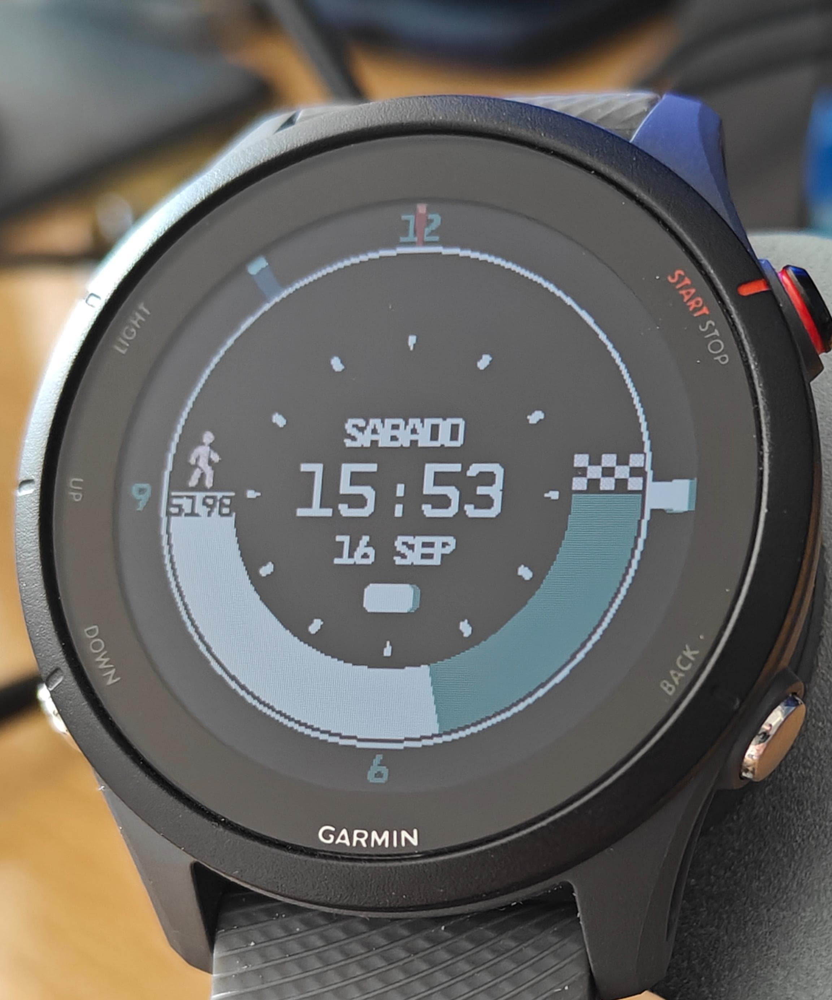

# Starfield watchface for Garmin



This project is a custom watchface inspired by the fictional smartwatch in the Starfield video game. It's designed for Garmin smartwatches, providing a sleek and futuristic look to your wearable device.

Tested in Garmin Forerunner 255, but should work easily with devices with the same resolution (260 x 260 pixels)

## Features

- Time and date display
- Battery status indicator
- Step counter

## How to Run in Simulator

Running the Starfield watchface in a simulator allows you to preview how it will look on your Garmin smartwatch without the need for the physical device. Follow these steps:

1. **Install Garmin Connect IQ SDK**: If you haven't already, download and install the Garmin Connect IQ SDK from [here](https://developer.garmin.com/connect-iq/sdk/).

2. **Setup your environment**: Download the last SDK and simulator for your device. Follow the guide from [here](https://developer.garmin.com/connect-iq/connect-iq-basics/getting-started/);

3. **Clone the Repository**: Clone this GitHub repository to your local machine using Git or by downloading the ZIP file.

```bash
git clone https://github.com/yourusername/starfield-watchface.git
```

4. **Run the application**: If you use Eclipse run using the Run button. In VSCode you can go by pressing F5 to launch the simulator and run the application.

5. **Build the application for a real device**: You can build the application generating a `.prg` file (either using Eclipse or the VSCode extension by using the `Monkey C: Build for Device` command). Drop this `.prg` file into the APPS folder of your Garmin watch and you're ready to go.

## Notes

There's still a lot of work to be done. There's a lot of magic numbers, missing translations and more. Contributors are more than welcome to improve it 😊

## License

This project is licensed under the MIT License - see the [LICENSE](LICENSE) file for details.
